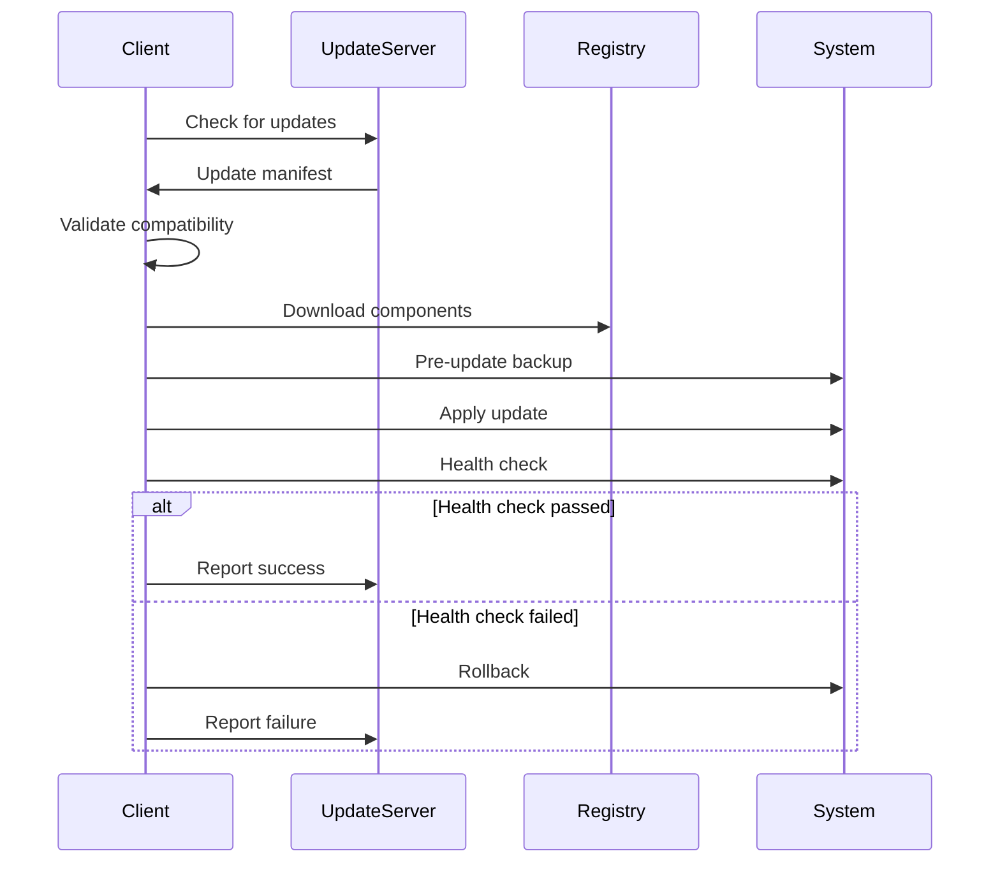

# Update Mechanisms - CM Diagnostics Platform

## Overview
This document outlines the comprehensive update strategy for the Content Manager Diagnostics & Auto-Remediation Platform, ensuring seamless updates with zero downtime.

## Update Architecture

### Update Components
```
Update System
├── Version Management
├── Update Server
├── Client Updater
├── Rollback Manager
└── Update Analytics

Distribution Channels
├── Stable Release
├── Beta Channel
├── Early Access
└── Custom Enterprise
```

## 1. Version Management System

### 1.1 Versioning Strategy
```yaml
version_format: "MAJOR.MINOR.PATCH-CHANNEL"

examples:
  stable: "2.4.1-stable"
  beta: "2.5.0-beta.3"
  nightly: "2.5.0-nightly.20240315"
  
semantic_versioning:
  major: "Breaking changes"
  minor: "New features, backward compatible"
  patch: "Bug fixes, performance improvements"
```

### 1.2 Release Manifest
```json
{
  "version": "2.4.1",
  "releaseDate": "2024-03-15T00:00:00Z",
  "channel": "stable",
  "minimumVersion": "2.0.0",
  "components": {
    "backend": {
      "version": "2.4.1",
      "sha256": "abc123...",
      "size": "125MB",
      "required": true
    },
    "frontend": {
      "version": "2.4.1",
      "sha256": "def456...",
      "size": "45MB",
      "required": true
    },
    "database": {
      "migrations": ["2.4.0-2.4.1.sql"],
      "rollback": ["2.4.1-2.4.0.sql"]
    }
  },
  "changelog": {
    "features": ["New diagnostic rules", "Performance improvements"],
    "fixes": ["Memory leak in diagnostic engine", "UI rendering issues"],
    "security": ["CVE-2024-1234 patched"]
  },
  "compatibility": {
    "contentManager": ["9.4+", "10.x", "23.x", "24.x", "25.x"],
    "database": ["PostgreSQL 14+", "15", "16"],
    "kubernetes": ["1.26+", "1.27", "1.28", "1.29"]
  }
}
```

## 2. Automatic Update System

### 2.1 Update Client Configuration
```typescript
interface UpdateConfig {
  enabled: boolean;
  channel: 'stable' | 'beta' | 'early-access' | 'custom';
  checkInterval: number; // minutes
  autoInstall: boolean;
  maintenanceWindow: {
    enabled: boolean;
    days: string[];
    startTime: string;
    endTime: string;
    timezone: string;
  };
  notifications: {
    email: string[];
    slack: string;
    teams: string;
  };
  rollback: {
    automatic: boolean;
    healthCheckTimeout: number;
    keepVersions: number;
  };
}

// Default configuration
const defaultConfig: UpdateConfig = {
  enabled: true,
  channel: 'stable',
  checkInterval: 360, // 6 hours
  autoInstall: false,
  maintenanceWindow: {
    enabled: true,
    days: ['saturday', 'sunday'],
    startTime: '02:00',
    endTime: '06:00',
    timezone: 'UTC'
  },
  notifications: {
    email: ['ops@company.com'],
    slack: '',
    teams: ''
  },
  rollback: {
    automatic: true,
    healthCheckTimeout: 300, // 5 minutes
    keepVersions: 3
  }
};
```

### 2.2 Update Workflow


### 2.3 Update API Endpoints
```typescript
// Update check endpoint
GET /api/v1/updates/check
Headers: {
  'X-Current-Version': '2.4.0',
  'X-Channel': 'stable',
  'X-License-Key': 'xxx-xxx-xxx'
}

Response: {
  "updateAvailable": true,
  "version": "2.4.1",
  "mandatory": false,
  "releaseNotes": "https://updates.cm-diagnostics.com/releases/2.4.1",
  "downloadUrl": "https://updates.cm-diagnostics.com/download/2.4.1",
  "signature": "sha256:abc123..."
}

// Update status endpoint
POST /api/v1/updates/status
Body: {
  "version": "2.4.1",
  "status": "completed|failed|in-progress",
  "timestamp": "2024-03-15T10:00:00Z",
  "details": {}
}
```

## 3. Zero-Downtime Update Strategy

### 3.1 Rolling Update Process
```yaml
apiVersion: apps/v1
kind: Deployment
metadata:
  name: cm-diagnostics
spec:
  replicas: 4
  strategy:
    type: RollingUpdate
    rollingUpdate:
      maxSurge: 1
      maxUnavailable: 1
  template:
    spec:
      containers:
      - name: app
        image: cm-diagnostics:2.4.1
        readinessProbe:
          httpGet:
            path: /health/ready
            port: 3000
          initialDelaySeconds: 30
          periodSeconds: 10
        livenessProbe:
          httpGet:
            path: /health/live
            port: 3000
          initialDelaySeconds: 60
          periodSeconds: 30
```

### 3.2 Database Migration Strategy
```sql
-- Migration script with safety checks
BEGIN;

-- Check current version
DO $$
DECLARE
    current_version TEXT;
BEGIN
    SELECT version INTO current_version 
    FROM schema_migrations 
    ORDER BY version DESC 
    LIMIT 1;
    
    IF current_version != '2.4.0' THEN
        RAISE EXCEPTION 'Invalid version for migration. Expected 2.4.0, got %', current_version;
    END IF;
END $$;

-- Apply migrations
ALTER TABLE diagnostics ADD COLUMN IF NOT EXISTS ml_score DECIMAL(5,4);
CREATE INDEX CONCURRENTLY IF NOT EXISTS idx_diagnostics_ml_score ON diagnostics(ml_score);

-- Update version
INSERT INTO schema_migrations (version, applied_at) VALUES ('2.4.1', NOW());

COMMIT;
```

### 3.3 Canary Deployment
```typescript
class CanaryDeployment {
  async deploy(version: string, percentage: number) {
    // Deploy to canary instances
    await this.deployCanary(version, percentage);
    
    // Monitor metrics
    const metrics = await this.monitorCanary(30); // 30 minutes
    
    // Evaluate success criteria
    if (this.evaluateMetrics(metrics)) {
      // Gradually increase traffic
      for (let traffic of [25, 50, 75, 100]) {
        await this.adjustTraffic(traffic);
        await this.wait(15); // 15 minutes
        
        if (!await this.healthCheck()) {
          await this.rollback();
          throw new Error('Canary deployment failed');
        }
      }
    } else {
      await this.rollback();
    }
  }
  
  evaluateMetrics(metrics: Metrics): boolean {
    return metrics.errorRate < 0.01 &&
           metrics.responseTime < 200 &&
           metrics.successRate > 0.99;
  }
}
```

## 4. Component Update Mechanisms

### 4.1 Backend Updates
```typescript
class BackendUpdater {
  async update(manifest: UpdateManifest) {
    // Download new version
    const binary = await this.download(manifest.backend);
    
    // Verify signature
    if (!await this.verifySignature(binary, manifest.backend.signature)) {
      throw new Error('Invalid signature');
    }
    
    // Backup current version
    await this.backup();
    
    // Graceful shutdown
    await this.gracefulShutdown();
    
    // Replace binary
    await this.replaceBinary(binary);
    
    // Start new version
    await this.start();
    
    // Health check
    if (!await this.healthCheck()) {
      await this.rollback();
    }
  }
}
```

### 4.2 Frontend Updates
```typescript
class FrontendUpdater {
  async update(manifest: UpdateManifest) {
    // Build new assets
    const assets = await this.buildAssets(manifest.frontend);
    
    // Deploy to CDN
    await this.deployCDN(assets);
    
    // Update service worker
    await this.updateServiceWorker();
    
    // Clear caches
    await this.clearCaches();
    
    // Notify clients
    await this.notifyClients();
  }
  
  async notifyClients() {
    // Send update notification via WebSocket
    this.broadcast({
      type: 'UPDATE_AVAILABLE',
      version: this.manifest.version,
      action: 'RELOAD_REQUIRED'
    });
  }
}
```

### 4.3 Database Updates
```typescript
class DatabaseUpdater {
  async update(migrations: string[]) {
    const connection = await this.connect();
    
    try {
      await connection.beginTransaction();
      
      for (const migration of migrations) {
        // Check if already applied
        if (await this.isApplied(migration)) {
          continue;
        }
        
        // Apply migration
        await this.applyMigration(migration);
        
        // Record migration
        await this.recordMigration(migration);
      }
      
      await connection.commit();
    } catch (error) {
      await connection.rollback();
      throw error;
    }
  }
}
```

## 5. Rollback Mechanisms

### 5.1 Automatic Rollback
```typescript
class RollbackManager {
  async checkAndRollback(version: string) {
    const healthChecks = [
      this.checkAPIHealth,
      this.checkDatabaseHealth,
      this.checkDiagnosticEngine,
      this.checkUIResponsiveness
    ];
    
    for (const check of healthChecks) {
      const result = await check();
      if (!result.healthy) {
        console.error(`Health check failed: ${result.reason}`);
        await this.initiateRollback(version);
        return;
      }
    }
  }
  
  async initiateRollback(fromVersion: string) {
    // Get previous version
    const previousVersion = await this.getPreviousVersion();
    
    // Notify administrators
    await this.notifyAdmins({
      event: 'ROLLBACK_INITIATED',
      from: fromVersion,
      to: previousVersion,
      reason: 'Health check failed'
    });
    
    // Execute rollback
    await this.executeRollback(previousVersion);
  }
}
```

### 5.2 Manual Rollback
```bash
#!/bin/bash
# Manual rollback script

CURRENT_VERSION=$(cat /app/version)
PREVIOUS_VERSION=$1

if [ -z "$PREVIOUS_VERSION" ]; then
  echo "Usage: rollback.sh <version>"
  exit 1
fi

echo "Rolling back from $CURRENT_VERSION to $PREVIOUS_VERSION"

# Stop current version
systemctl stop cm-diagnostics

# Restore previous version
cp -r /backups/$PREVIOUS_VERSION/* /app/

# Restore database
psql -U cmuser -d cm_diagnostics < /backups/$PREVIOUS_VERSION/database.sql

# Start previous version
systemctl start cm-diagnostics

# Verify
if systemctl is-active cm-diagnostics; then
  echo "Rollback successful"
else
  echo "Rollback failed"
  exit 1
fi
```

## 6. Update Notifications

### 6.1 In-App Notifications
```typescript
interface UpdateNotification {
  id: string;
  type: 'info' | 'warning' | 'critical';
  version: string;
  title: string;
  description: string;
  actions: Array<{
    label: string;
    action: 'install' | 'dismiss' | 'learn-more';
  }>;
  expiresAt: Date;
}

class NotificationManager {
  async notify(update: UpdateManifest) {
    const notification: UpdateNotification = {
      id: crypto.randomUUID(),
      type: update.mandatory ? 'critical' : 'info',
      version: update.version,
      title: `Update ${update.version} available`,
      description: this.summarizeChanges(update.changelog),
      actions: [
        { label: 'Install Now', action: 'install' },
        { label: 'Schedule', action: 'schedule' },
        { label: 'Learn More', action: 'learn-more' }
      ],
      expiresAt: new Date(Date.now() + 7 * 24 * 60 * 60 * 1000)
    };
    
    await this.broadcast(notification);
  }
}
```

### 6.2 Email Notifications
```html
<!-- Update notification email template -->
<!DOCTYPE html>
<html>
<head>
  <title>CM Diagnostics Update Available</title>
</head>
<body>
  <h2>Update {{version}} is now available</h2>
  
  <h3>What's New:</h3>
  <ul>
    {{#each changelog.features}}
    <li>✨ {{this}}</li>
    {{/each}}
  </ul>
  
  <h3>Bug Fixes:</h3>
  <ul>
    {{#each changelog.fixes}}
    <li>🐛 {{this}}</li>
    {{/each}}
  </ul>
  
  {{#if changelog.security}}
  <h3>Security Updates:</h3>
  <ul>
    {{#each changelog.security}}
    <li>🔒 {{this}}</li>
    {{/each}}
  </ul>
  {{/if}}
  
  <p>
    <a href="{{updateUrl}}" style="button">Update Now</a>
    <a href="{{releaseNotesUrl}}">View Release Notes</a>
  </p>
</body>
</html>
```

## 7. Update Analytics

### 7.1 Update Metrics
```typescript
interface UpdateMetrics {
  version: string;
  channel: string;
  updateTime: number;
  success: boolean;
  rollbacks: number;
  errors: string[];
  performance: {
    downloadTime: number;
    installTime: number;
    migrationTime: number;
  };
}

class UpdateAnalytics {
  async track(metrics: UpdateMetrics) {
    // Store in time-series database
    await this.prometheus.record({
      metric: 'update_duration_seconds',
      value: metrics.updateTime,
      labels: {
        version: metrics.version,
        channel: metrics.channel,
        success: metrics.success.toString()
      }
    });
    
    // Send to analytics service
    await this.analytics.track('update_completed', metrics);
  }
}
```

### 7.2 Update Dashboard
```yaml
update_dashboard:
  panels:
    - title: "Update Success Rate"
      query: |
        (sum(update_success_total) / sum(update_attempts_total)) * 100
        
    - title: "Average Update Time"
      query: |
        avg(update_duration_seconds)
        
    - title: "Updates by Channel"
      query: |
        sum by (channel) (update_attempts_total)
        
    - title: "Rollback Rate"
      query: |
        (sum(update_rollbacks_total) / sum(update_attempts_total)) * 100
```

## 8. Enterprise Update Management

### 8.1 Update Policy
```json
{
  "enterprisePolicy": {
    "approvalRequired": true,
    "approvers": ["admin@company.com", "ops-team@company.com"],
    "testingRequired": true,
    "testEnvironments": ["staging", "qa"],
    "minimumTestDuration": "48h",
    "blockedVersions": [],
    "allowedChannels": ["stable", "custom"],
    "complianceChecks": [
      "security-scan",
      "license-validation",
      "dependency-audit"
    ]
  }
}
```

### 8.2 Staged Rollout
```typescript
class StagedRollout {
  stages = [
    { name: 'dev', percentage: 100, duration: '24h' },
    { name: 'staging', percentage: 100, duration: '48h' },
    { name: 'production-canary', percentage: 5, duration: '24h' },
    { name: 'production-partial', percentage: 25, duration: '48h' },
    { name: 'production-majority', percentage: 75, duration: '24h' },
    { name: 'production-full', percentage: 100, duration: null }
  ];
  
  async execute(version: string) {
    for (const stage of this.stages) {
      await this.deployToStage(stage, version);
      
      if (stage.duration) {
        await this.monitor(stage.duration);
        
        if (!await this.validateStage(stage)) {
          await this.haltRollout();
          break;
        }
      }
    }
  }
}
```

## 9. Update Security

### 9.1 Signature Verification
```typescript
class UpdateSecurity {
  async verifyUpdate(update: Update) {
    // Verify GPG signature
    const publicKey = await this.getPublicKey();
    const signature = update.signature;
    const payload = update.payload;
    
    const verified = await crypto.verify(
      'sha256',
      Buffer.from(payload),
      publicKey,
      Buffer.from(signature, 'base64')
    );
    
    if (!verified) {
      throw new Error('Update signature verification failed');
    }
    
    // Verify checksum
    const checksum = crypto.createHash('sha256')
      .update(payload)
      .digest('hex');
      
    if (checksum !== update.checksum) {
      throw new Error('Update checksum verification failed');
    }
  }
}
```

### 9.2 Secure Update Channel
```yaml
update_security:
  transport:
    protocol: "https"
    tls_version: "1.3"
    certificate_pinning: true
    
  authentication:
    method: "mutual_tls"
    client_certificate: required
    
  integrity:
    signature: "gpg"
    checksum: "sha256"
    
  authorization:
    license_validation: true
    entitlement_check: true
```

## 10. Update Testing

### 10.1 Update Test Suite
```typescript
describe('Update System Tests', () => {
  test('Successful update flow', async () => {
    const updater = new UpdateSystem();
    const result = await updater.update('2.4.1');
    
    expect(result.success).toBe(true);
    expect(result.version).toBe('2.4.1');
    expect(await checkSystemHealth()).toBe(true);
  });
  
  test('Rollback on failure', async () => {
    const updater = new UpdateSystem();
    // Simulate failure
    jest.spyOn(updater, 'healthCheck').mockResolvedValue(false);
    
    const result = await updater.update('2.4.1');
    
    expect(result.success).toBe(false);
    expect(result.rolledBack).toBe(true);
    expect(await getCurrentVersion()).toBe('2.4.0');
  });
  
  test('Concurrent update prevention', async () => {
    const updater = new UpdateSystem();
    
    const update1 = updater.update('2.4.1');
    const update2 = updater.update('2.4.2');
    
    await expect(update2).rejects.toThrow('Update already in progress');
  });
});
```

---

This comprehensive update mechanism ensures reliable, secure, and seamless updates for the CM Diagnostics Platform with minimal disruption to users.